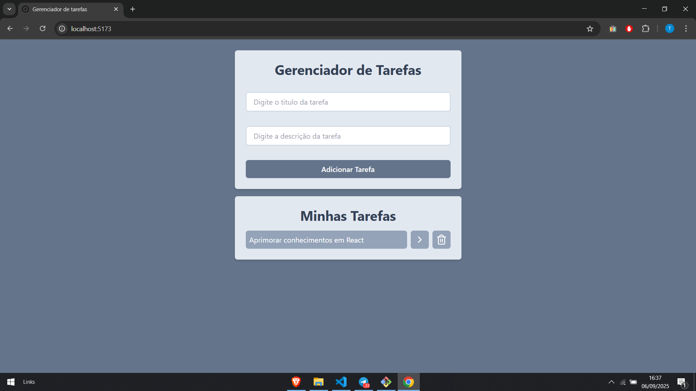

# Gerenciador de Tarefas

Um simples e eficiente **Gerenciador de Tarefas** desenvolvido com **React**, **Vite** e **TailwindCSS**.

Permite adicionar, visualizar e excluir tarefas de forma prática, com uma interface minimalista e responsiva.

---

## Tecnologias utilizadas

- ⚛️ [React](https://react.dev/) — Biblioteca para construção de interfaces
- ⚡ [Vite](https://vitejs.dev/) — Bundler rápido para desenvolvimento frontend
- 🎨 [TailwindCSS](https://tailwindcss.com/) — Estilização utilitária
- 🔗 [React Router DOM](https://reactrouter.com/) — Navegação de rotas
- 🆔 [UUID](https://www.npmjs.com/package/uuid) — Geração de identificadores únicos
- 🎨 [Lucide React](https://lucide.dev/) — Ícones modernos para React

---

## Estrutura do projeto

```
📦 task
┣ 📂 src
┃ ┣ 📂 components # Componentes reutilizáveis
┃ ┣ 📂 pages # Páginas principais
┃ ┣ 📂 styles # Estilos globais (Tailwind)
┃ ┣ App.jsx # Componente raiz
┃ ┗ main.jsx # Ponto de entrada da aplicação
┣ 📜 package.json # Dependências e scripts
┗ 📜 vite.config.js # Configuração do Vite
```

---

## Preview



---

## Como rodar o projeto

1. Clone o repositório:

```bash
git clone https://github.com/thiaguss/TaskManager.git
```

2. Instale as dependências:

```bash
npm install
```

3. Rode o servidor de desenvolvimento:

```bash
npm run dev
```

4. Acesse no navegador:

```bash
http://localhost:5173
```

## Scripts disponíveis

- `npm run dev` → Inicia o servidor de desenvolvimento
- `npm run build` → Gera a versão otimizada para produção
- `npm run preview` → Visualiza a versão de produção localmente
- `npm run lint` → Executa o linter (ESLint)

## Funcionalidades

- Adicionar novas tarefas com título e descrição
- Listar todas as tarefas adicionadas
- Excluir tarefas indesejadas
- Interface responsiva e intuitiva
